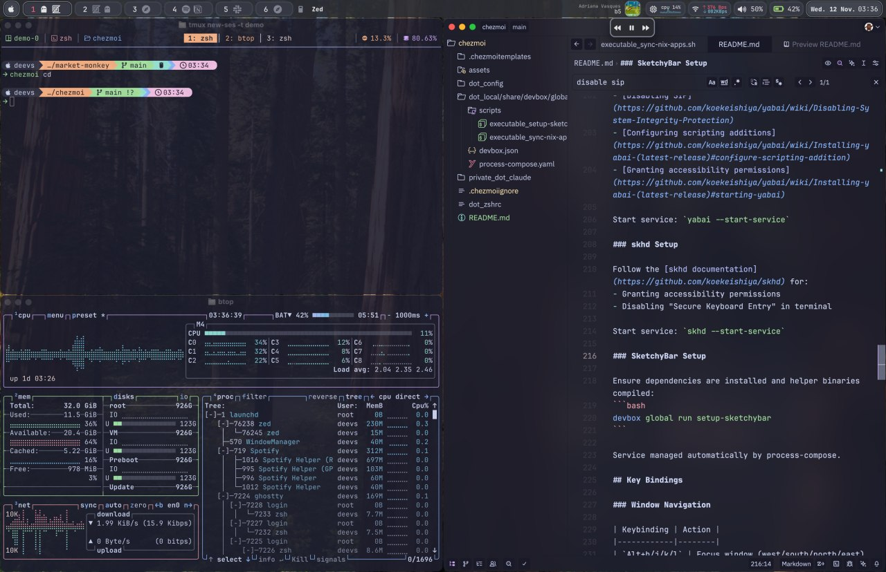

# Dotfiles

HIGHLY opinionated macOS & Linux configuration managed with [chezmoi](https://www.chezmoi.io) and [devbox](https://www.jetify.com/devbox). Contains only tools and applications used daily with zEr0 bloat.



## Package Management

Everything is managed through [devbox](https://www.jetify.com/devbox) - a Nix-based package manager that provides reproducible development environments.

### Why Devbox?

- Single source of truth for all packages in [`.local/share/devbox/global/default/devbox.json`](dot_local/share/devbox/global/default/devbox.json)
- Reproducible across machines
- No conflicts between package versions
- Both CLI tools and GUI applications
- Automatic application syncing to Spotlight/Raycast

### Platform-Specific Packages

Devbox supports platform-specific packages via `platforms` field in `devbox.json`. macOS-only packages (GUI apps, window management) are automatically skipped on Linux.

### Custom Shell Functions

Defined in [`.zshrc`](dot_zshrc):

```bash
dbadd package-name       # Add package (all platforms) and sync to chezmoi
dbrm package-name        # Remove package and sync to chezmoi
dbsync                   # Manually sync devbox.json to chezmoi
dbadd-mac package-name   # Add macOS-only package
dbadd-linux package-name # Add Linux-only package
```

### Process Management

[process-compose](https://github.com/F1bonacc1/process-compose) manages background services:
- Configuration: [`.local/share/devbox/global/default/process-compose.yaml`](dot_local/share/devbox/global/default/process-compose.yaml)
- Services: tailscaled, sketchybar

### Helper Scripts

Located in [`.local/share/devbox/global/default/scripts/`](dot_local/share/devbox/global/default/scripts/):

- `setup-sketchybar-deps.sh` - Installs SketchyBar dependencies
- `sync-nix-apps.sh` - Creates aliases for GUI apps in Spotlight/Raycast

## Prerequisites

### macOS
- macOS (Big Sur or later)
- [Devbox](https://www.jetify.com/devbox/docs/installing_devbox/)
- [Homebrew](https://brew.sh) - Only required for SketchyBar icons (SF Symbols, fonts, media-control)
- Command Line Tools: `xcode-select --install`

### Linux
- [Devbox](https://www.jetify.com/devbox/docs/installing_devbox/)
- Nix package manager (installed automatically by Devbox)

## Components

### Window Management (macOS only)

- **[yabai](https://github.com/koekeishiya/yabai)** - Tiling window manager
  - Requires SIP (System Integrity Protection) to be disabled for scripting additions
  - [Disable SIP instructions](https://github.com/koekeishiya/yabai/wiki/Disabling-System-Integrity-Protection)
  - Configuration: [`.config/yabai/yabairc`](dot_config/yabai/yabairc)
  - Uses BSP layout with external bar support for SketchyBar
  - Configured to run with elevated privileges for scripting additions

- **[skhd](https://github.com/koekeishiya/skhd)** - Hotkey daemon
  - Requires Accessibility permissions
  - Disable "Secure Keyboard Entry" in Terminal/iTerm2
  - Configuration: [`.config/skhd/skhdrc`](dot_config/skhd/skhdrc)
  - Vim-style navigation (hjkl) for window focus and movement

- **[SketchyBar](https://github.com/FelixKratz/SketchyBar)** - Custom status bar
  - Configuration: [`.config/sketchybar/`](dot_config/sketchybar/)
  - Uses Lua for configuration
  - Requires compiled helper binaries and additional dependencies (via Homebrew)
  - Integrates with yabai for workspace and window information

### Terminal & Shell

- **[Ghostty](https://ghostty.org)** - GPU-accelerated terminal (macOS only)
  - Configuration: [`.config/ghostty/config`](dot_config/ghostty/config)
  - Theme: Catppuccin Mocha
  - Font: JetBrainsMono Nerd Font
  - Background opacity: 0.95

- **[zsh](https://www.zsh.org)** - Shell
  - Configuration: [`.zshrc`](dot_zshrc)
  - Plugin manager: [zinit](https://github.com/zdharma-continuum/zinit)
  - Plugins: syntax-highlighting, completions, autosuggestions, fzf-tab
  - History: 5000 entries with deduplication

- **[starship](https://starship.rs)** - Shell prompt
  - Configuration: [`.config/starship/`](dot_config/starship/)
  - Cross-shell prompt with git integration

- **[tmux](https://github.com/tmux/tmux)** - Terminal multiplexer
  - Configuration: [`.config/tmux/tmux.conf`](dot_config/tmux/tmux.conf)
  - Prefix: `Ctrl-s`
  - Plugins managed via devbox (installed from Nix)
  - Theme: Catppuccin Mocha
  - Plugins: vim-tmux-navigator, yank, resurrect, continuum, sensible

### Editors & AI Tools

- **[Neovim](https://neovim.io)** - Text editor
  - Configuration: [`.config/nvim/`](dot_config/nvim/)
  - Plugin manager: [lazy.nvim](https://github.com/folke/lazy.nvim)
  - Plugins defined in [`lua/plugins/`](dot_config/nvim/lua/plugins/)

- **[Zed](https://zed.dev)** - Code editor (macOS only)
  - Configuration: [`.config/zed/`](dot_config/zed/)
  - Set as default `$EDITOR` via `zeditor --wait`

- **[Claude Code](https://docs.claude.com/docs/claude-code)** - AI coding assistant CLI
  - Configuration: [`.claude/settings.json`](private_dot_claude/settings.json)
  - Environment: Disables zoxide in Claude Code sessions

- **[OpenCode](https://opencode.ai)** - AI code assistant
  - Configuration: [`.config/opencode/opencode.json`](dot_config/opencode/empty_opencode.json.tmpl)
  - Theme: Catppuccin
  - MCP integration with Context7
  - 1Password integration for API keys

### System Utilities

- **[btop](https://github.com/aristocratos/btop)** - System monitor
  - Configuration: [`.config/btop/btop.conf`](dot_config/btop/btop.conf)
  - Theme: Catppuccin Mocha
  - Vim keybindings enabled

- **[fzf](https://github.com/junegunn/fzf)** - Fuzzy finder
  - Integrated with zsh for history and file search
  - Works with fzf-tab for command completion

- **[zoxide](https://github.com/ajeetdsouza/zoxide)** - Smart directory jumper
  - Replaces `cd` command
  - Learns frequently accessed directories

- **[ripgrep](https://github.com/BurntSushi/ripgrep)** - Fast search tool
- **[bat](https://github.com/sharkdp/bat)** - Enhanced `cat` with syntax highlighting
- **[vivid](https://github.com/sharkdp/vivid)** - LS_COLORS generator (Catppuccin Mocha theme)

### Applications

#### Cross-platform (macOS & Linux)
- **CLI Tools**: ripgrep, fzf, bat, zoxide, btop, k9s
- **Cloud/DevOps**: awscli2, kubectl, kubectx, google-cloud-sdk
- **Development**: neovim, tmux, bun, rustup, postgresql
- **Networking**: Tailscale, 1Password CLI
- **Other**: Magic Wormhole

#### macOS only (GUI apps)
Managed via devbox and available in Spotlight/Raycast after sync:

- **Communication**: Telegram, Slack, Discord, Zoom
- **Productivity**: Notion, Raycast
- **Development**: DBeaver, Cursor, Zed
- **Media**: Spotify
- **Networking**: WireGuard
- **Browsers**: Google Chrome
- **Other**: Transmission

## Installation

### 1. Install Devbox

```bash
curl -fsSL https://get.jetify.com/devbox | bash
```

### 2. Initialize Devbox Global

```bash
devbox global pull
```

### 3. Install Dotfiles with Chezmoi

```bash
# Initialize chezmoi with this repository
chezmoi init https://github.com/YOUR_USERNAME/YOUR_REPO.git

# Review changes before applying
chezmoi diff

# Apply dotfiles
chezmoi apply
```

### 4. Install SketchyBar Dependencies (macOS only)

```bash
devbox global run setup-sketchybar
```

This script will:
- Install Homebrew (if not present)
- Install media-control
- Install SF Symbols and SF fonts
- Download sketchybar-app-font
- Compile SketchyBar helper binaries

### 5. Sync Nix Applications to Spotlight/Raycast (macOS only)

```bash
devbox global run sync-nix-apps
```

Creates aliases in `~/Applications/installed via DevBox/` for all devbox-installed GUI applications.

## Post-Installation Configuration (macOS only)

### yabai Setup

Follow the official installation guide for:
- [Disabling SIP](https://github.com/koekeishiya/yabai/wiki/Disabling-System-Integrity-Protection)
- [Configuring scripting additions](https://github.com/koekeishiya/yabai/wiki/Installing-yabai-(latest-release)#configure-scripting-addition)
- [Granting accessibility permissions](https://github.com/koekeishiya/yabai/wiki/Installing-yabai-(latest-release)#starting-yabai)

Start service: `yabai --start-service`

### skhd Setup

Follow the [skhd documentation](https://github.com/koekeishiya/skhd) for:
- Granting accessibility permissions
- Disabling "Secure Keyboard Entry" in terminal

Start service: `skhd --start-service`

### SketchyBar Setup

Ensure dependencies are installed and helper binaries compiled:
```bash
devbox global run setup-sketchybar
```

Service managed automatically by process-compose.

## Key Bindings (macOS only)

### Window Navigation

| Keybinding | Action |
|------------|--------|
| `Alt+h/j/k/l` | Focus window (west/south/north/east) |
| `Alt+s/g` | Focus display (west/east) |
| `Alt+1-9,0` | Focus space 1-10 |
| `Alt+Tab` | Focus recent space |
| `Alt+Left/Right` | Focus previous/next space |

### Window Movement

| Keybinding | Action |
|------------|--------|
| `Shift+Alt+h/j/k/l` | Swap window (west/south/north/east) |
| `Shift+Alt+1-9,0` | Move window to space 1-10 and follow |
| `Shift+Alt+s/g` | Move window to display (west/east) and follow |
| `Shift+Alt+Left/Right` | Move window to previous/next space and follow |

### Window Sizing

| Keybinding | Action |
|------------|--------|
| `Ctrl+Alt+h/j/k/l` | Resize window |
| `Ctrl+Alt+e` | Equalize window sizes |

### Window State

| Keybinding | Action |
|------------|--------|
| `Alt+t` | Toggle float |
| `Alt+f` | Toggle fullscreen |
| `Alt+d` | Toggle parent zoom |
| `Alt+e` | Toggle split type |
| `Alt+r` | Rotate tree 90° |
| `Alt+y/x` | Mirror tree (y-axis/x-axis) |

### Applications

| Keybinding | Action |
|------------|--------|
| `Alt+Return` | Open Ghostty |
| `Alt+b` | Open Safari |
| `Alt+z` | Open Zed |

### System

| Keybinding | Action |
|------------|--------|
| `Shift+Ctrl+Alt+r` | Restart yabai |
| `Shift+Alt+Space` | Toggle SketchyBar visibility |

### tmux

| Keybinding | Action |
|------------|--------|
| `Ctrl+s` | Prefix key |
| `Prefix+r` | Reload configuration |
| `Prefix+h/j/k/l` | Navigate panes |

## Customization

### Adding/Removing Packages

```bash
# Add a package (all platforms)
dbadd package-name

# Add macOS-only package
dbadd-mac package-name

# Add Linux-only package
dbadd-linux package-name

# Remove a package
dbrm package-name

# Manually edit devbox.json
zeditor ~/.local/share/devbox/global/default/devbox.json

# Then sync
dbsync
```

### Modifying Configurations

Edit files directly and apply with chezmoi:

```bash
# Edit in chezmoi source directory
chezmoi edit ~/.config/yabai/yabairc

# Or edit the managed file directly
zeditor ~/.config/yabai/yabairc

# Add changes to chezmoi
chezmoi add ~/.config/yabai/yabairc

# Apply changes
chezmoi apply
```

## Theme

All applications are configured with **Catppuccin Mocha** theme:
- Ghostty
- tmux (via catppuccin plugin)
- btop
- Neovim (via plugins)
- SketchyBar (custom Lua configuration)
- OpenCode

## Troubleshooting

### macOS

#### yabai Not Working

1. Verify SIP is disabled: `csrutil status`
2. Check accessibility permissions
3. Verify sudo configuration: `sudo yabai --load-sa`
4. Check logs: `tail -f /tmp/yabai_$USER.err.log`

#### skhd Hotkeys Not Working

1. Check accessibility permissions
2. Disable "Secure Keyboard Entry" in terminal
3. Check logs: `tail -f /tmp/skhd_$USER.err.log`

#### SketchyBar Not Showing

1. Ensure dependencies are installed: `devbox global run setup-sketchybar`
2. Check if helper binaries are compiled: `ls ~/.config/sketchybar/helpers/bin/`
3. Restart: `sketchybar --reload`

#### Applications Not in Spotlight

Run the sync script:
```bash
devbox global run sync-nix-apps
```

### Linux

#### Devbox packages not installing

1. Ensure Nix is installed: `nix --version`
2. Check devbox status: `devbox global list`
3. Try refreshing: `devbox global shellenv`

## Resources

- [chezmoi documentation](https://www.chezmoi.io/docs/)
- [devbox documentation](https://www.jetify.com/devbox/docs/)
- [yabai wiki](https://github.com/koekeishiya/yabai/wiki)
- [SketchyBar documentation](https://felixkratz.github.io/SketchyBar/)
- [Catppuccin theme](https://github.com/catppuccin/catppuccin)
